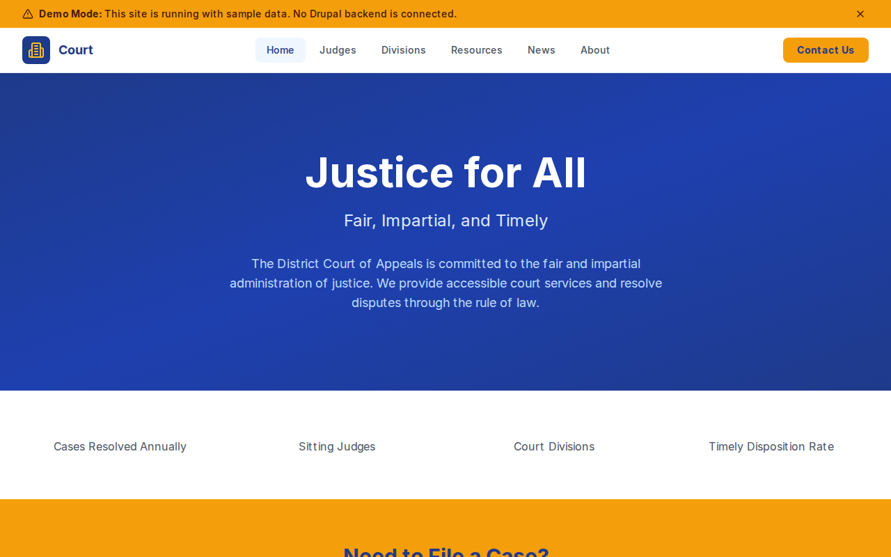

# Decoupled Court

A court system website starter template for Decoupled Drupal + Next.js. Built for courts, judicial systems, and legal institutions.



## Features

- **Judges Directory** - Judicial officer profiles with positions, divisions, chambers, and appointment dates
- **Court Divisions** - Division pages for civil, criminal, family, and appellate courts
- **Legal Resources** - Court forms, filing guides, fee schedules, and legal instructions
- **Court News** - Opinions, announcements, press releases, and court orders
- **Modern Design** - Clean, accessible UI optimized for judicial and legal content

## Quick Start

### 1. Clone the template

```bash
npx degit nextagencyio/decoupled-court my-court
cd my-court
npm install
```

### 2. Run interactive setup

```bash
npm run setup
```

This interactive script will:
- Authenticate with Decoupled.io (opens browser)
- Create a new Drupal space
- Wait for provisioning (~90 seconds)
- Configure your `.env.local` file
- Import sample content

### 3. Start development

```bash
npm run dev
```

Visit [http://localhost:3000](http://localhost:3000)

---

## Manual Setup

<details>
<summary>Click to expand manual setup steps</summary>

### Authenticate with Decoupled.io

```bash
npx decoupled-cli@latest auth login
```

### Create a Drupal space

```bash
npx decoupled-cli@latest spaces create "My Court"
```

Note the space ID returned. Wait ~90 seconds for provisioning.

### Configure environment

```bash
npx decoupled-cli@latest spaces env 1234 --write .env.local
```

### Import content

```bash
npm run setup-content
```

This imports:
- Homepage with hero, statistics, and CTAs
- 4 Judges (Chief Judge, 3 Associate Judges)
- 3 Court Divisions (Civil, Criminal, Family)
- 4 Court Resources (complaint form, filing guide, fee schedule, appeal instructions)
- 3 News Articles (privacy ruling, e-filing launch, judicial conference)
- 2 Static Pages (About, Filing Information)

</details>

## Content Types

### Judge
- **title**: Judge name
- **body**: Biography and background
- **position**: Chief Judge, Associate Judge, etc.
- **division**: Court division assignment
- **chambers**: Courtroom location
- **phone**: Contact phone
- **photo**: Official portrait
- **appointed_date**: Date of appointment

### Court Division
- **title**: Division name
- **body**: Jurisdiction and case types
- **chief_judge**: Presiding judge name
- **location**: Floor/building location
- **phone**: Division phone
- **division_type**: Division classification
- **image**: Division image

### Court Resource
- **title**: Resource name
- **body**: Instructions and details
- **resource_type**: Forms, guides, fee schedules, instructions
- **file_url**: Download URL
- **last_updated**: Last revision date
- **image**: Resource image

### News Article
- **title**: Headline
- **body**: Article content
- **image**: Featured image
- **category**: Opinions, announcements, press releases, court orders
- **featured**: Featured flag

## Customization

### Colors & Branding
Edit `tailwind.config.js` to customize colors, fonts, and spacing.

### Content Structure
Modify `data/court-content.json` to add or change content types and sample content.

### Components
React components are in `app/components/`. Update them to match your design needs.

## Demo Mode

Demo mode allows you to showcase the application without connecting to a Drupal backend.

### Enable Demo Mode

```bash
NEXT_PUBLIC_DEMO_MODE=true
```

### Removing Demo Mode

1. Delete `lib/demo-mode.ts`
2. Delete `data/mock/` directory
3. Delete `app/components/DemoModeBanner.tsx`
4. Remove `DemoModeBanner` from `app/layout.tsx`
5. Remove demo mode checks from `app/api/graphql/route.ts`

## Deployment

### Vercel (Recommended)
[](https://vercel.com/new/clone?repository-url=https://github.com/nextagencyio/decoupled-court)

### Other Platforms
Works with any Node.js hosting platform that supports Next.js.

## Documentation

- [Decoupled.io Docs](https://www.decoupled.io/docs)
- [Next.js Documentation](https://nextjs.org/docs)
- [Drupal GraphQL](https://www.decoupled.io/docs/graphql)

## License

MIT
